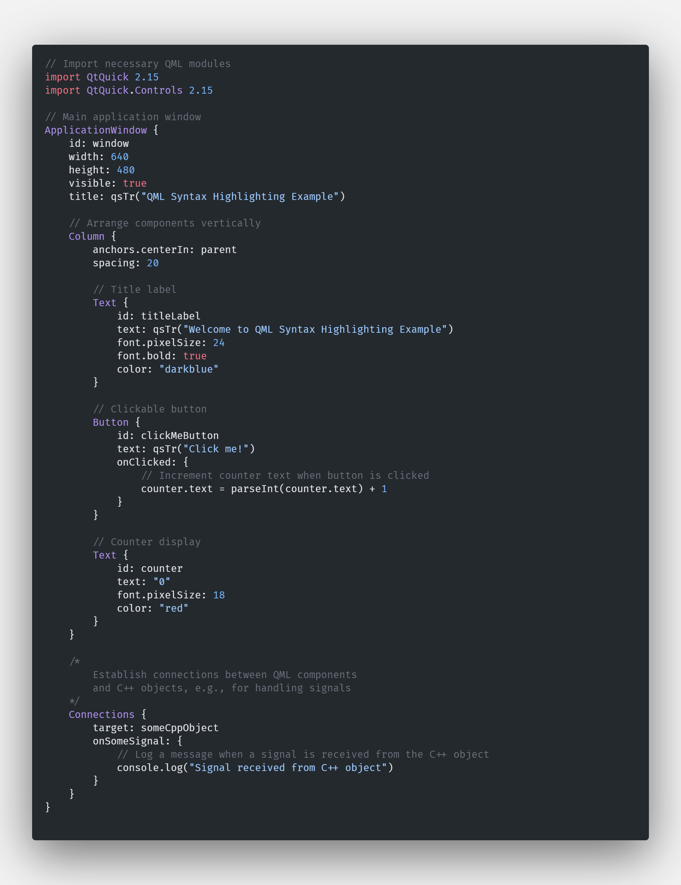

# QML Syntax Highlighting for Visual Studio Code



## Features

* Syntax highlighting for QML files
* Supports various QML language features, including:
* Comments
* Strings
* Numbers
* Keywords
* Identifiers
* Punctuation
* Brackets
* Properties and parameters

## Installation from GitHub

1. Clone the repository to your local machine:
   
   ```
   git clone https://github.com/fresh-milkshake/qml-vscode.git
   ```

2. Copy the `qml-vscode` folder to your Visual Studio Code extensions folder:
   
   * On Windows: `%USERPROFILE%\.vscode\extensions`
   * On macOS: `$HOME/.vscode/extensions`
   * On Linux: `$HOME/.vscode/extensions`

3. Restart Visual Studio Code.

4. After installation, the extension will automatically highlight QML files.

## Usage

Simply open a QML file in Visual Studio Code, and the syntax highlighting will be automatically applied.

## Contributing

Contributions are welcome! If you encounter any issues or want to improve the extension, feel free to create an issue or submit a pull request on the [repository](https://github.com/fresh-milkshake/qml-vscode).

## License

This extension is licensed under the [MIT License](LICENSE).

## Credits

This extension is developed and maintained by [fresh-milkshake](https://github.com/fresh-milkshake).
