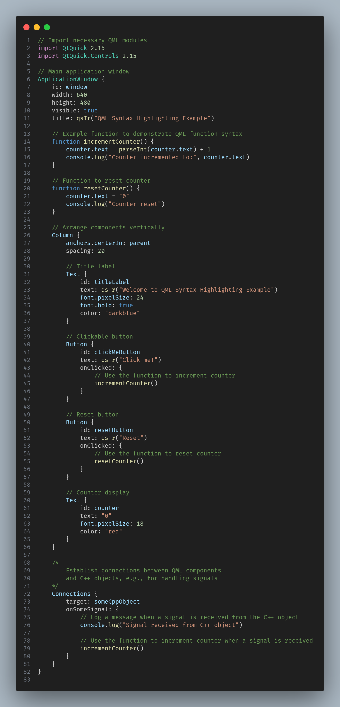

## Overview

Syntax highlighting extension for QML (Qt Modeling Language) files in Visual Studio Code.

## Installation

### From VS Code Marketplace
1. Open VS Code Extensions (Ctrl+Shift+X)
2. Search for "QML Highlighting"
3. Click Install

### From Command Palette
1. Open Command Palette (Ctrl+Shift+P)
2. Type `ext install fresh-milkshake.qml-language-highlighting`
3. Press Enter

### From VSIX File
1. Download `.vsix` from [Releases](https://github.com/fresh-milkshake/qml-vscode/releases)
2. Command Palette → `Extensions: Install from VSIX...`
3. Select downloaded file

## What's Highlighted

| Element         | Example                                  |
| --------------- | ---------------------------------------- |
| QML Components  | `Rectangle`, `Text`, `Button`            |
| Properties      | `width: 100`, `anchors.centerIn: parent` |
| JavaScript      | `{ return x * 2 }`                       |
| Signal Handlers | `onClicked: { ... }`                     |
| Types           | `property int count: 0`                  |
| Functions       | `Qt.rgba(1, 0, 0, 1)`, `qsTr("Hello")` |
| Comments        | `// Single line`, `/* Block */`          |
| Strings         | `"Hello World"`, `'Single quotes'`       |
| Numbers         | `42`, `3.14`, `0xFF`, `0b101`            |

## Highlighting Example

## License

This project is licensed under the MIT License. See [LICENSE](LICENSE) file for details.